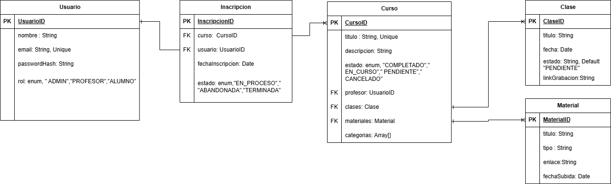

# Grupo 25

Integrantes: Angelina Rossi y Alvarez Lisandro.

# Documentación del Proyecto

# Sistema de Gestión de Cursos Online

# Descripción General

Este proyecto es un sistema completo para la gestión de cursos online compuesto por un backend en Node.js + TypeScript y un frontend en React + Vite. El objetivo principal del sistema es permitir la administración de cursos, usuarios y contenido educativo, brindando una experiencia fluida tanto para alumnos como para administradores.

# UML

# Funcionalidades principales

 Frontend

Interfaz moderna en React
Gestión de usuarios
Listado y visualización de cursos
Autenticación
Consumo de API REST

 Backend

API REST con Express
Rutas protegidas y sistema de autenticación
Gestión de cursos, usuarios y sesiones
Validación de datos

# Tecnologías utilizadas

 Backend

Node.js + Express
TypeScript
JWT para autenticación
Dotenv para configuración

 Frontend

React + Vite
TypeScript
React Router
Fetch API para comunicación con backend

# La API sigue formato REST e incluye:

Autenticación (login/register)

Gestión de cursos

Gestión de usuarios

Envío y recepción de datos en JSON

# Decisiones de arquitectura

Se eligió Node.js + Express por su rapidez para prototipado de APIs REST.
Se utiliza TypeScript para mejorar mantenibilidad y escalabilidad.
React se eligió por su modularidad y facilidad para gestionar UI dinámicas.
Vite se seleccionó por su velocidad de desarrollo comparado con Webpack.
Convenciones de código

Estándares de estilo basados en Google Styleguide.
Rutas separadas por módulo.
Controllers → lógica de entrada/salida
Services → lógica de negocio
Models → acceso a datos

# Instalación

 Clonar el repositorio git clone https://github.com/LiFranAlvarez/ProyectoFinal.git

# En windows(como administrador):

 Verificar si Winget está disponible
winget --version

 Instalar MongoDB Server + Mongosh
winget install MongoDB.Server --source winget
winget install MongoDB.Shell

 Verificar instalación
mongod --version
mongosh --version

 Iniciar servicio de MongoDB
mongosh

 Para ver si está corriendo:
sc query MongoDB

 Para detenerlo:
net stop MongoDB

 Para iniciarlo:
net start MongoDB

# En linux

 Importar clave de MongoDB
curl -fsSL https://pgp.mongodb.com/server-7.0.asc | \
sudo gpg -o /usr/share/keyrings/mongodb-server-7.0.gpg --dearmor

 Agregar repositorio oficial (Ubuntu 22.04 Jammy)
echo "deb [signed-by=/usr/share/keyrings/mongodb-server-7.0.gpg] \
https://repo.mongodb.org/apt/ubuntu jammy/mongodb-org/7.0 multiverse" | \
sudo tee /etc/apt/sources.list.d/mongodb-org-7.0.list

 Actualizar lista de paquetes
sudo apt update

 Instalar MongoDB
sudo apt install -y mongodb-org

 Iniciar MongoDB
sudo systemctl start mongod

 Habilitar inicio automático
sudo systemctl enable mongod

 Verificar estado
sudo systemctl status mongod

 Verificar instalación
mongod --version
mongosh --version

# Para levantar Backend

cd backend
npm install
npm run build
npm run dev

# Para levantar Frontend

cd frontend
npm install
npm run dev

# POST MAN

1|cargar un profesor -> POST http://localhost:3000/api/usuario 
{ "nombre": "PROFESOR 1 ", "email": "profesor1@hotmail.com", "password": "profesor" , "rol": "PROFESOR" }

2| cargar clases -> POST http://localhost:3000/api/clases 
[ { "titulo": "Introducción a Node.js", "estado": "DISPONIBLE", "linkGrabacion": "https://youtu.be/nodejs-intro" }, { "titulo": "Express y Rutas Básicas", "estado": "PENDIENTE", "linkGrabacion": "" } ]

3| cargar material -> POST http://localhost:3000/api/materiales

[{ "titulo": "Guía de Wireframes", "tipo": "PDF", "enlace": "https://uxdocs.com/wireframes-guide.pdf" }, { "titulo": "Prototipado con Figma", "tipo": "Video", "enlace": "https://vimeo.com/figma-prototyping" } ]

4| cargar cursos -> POST http://localhost:3000/api/cursos

{ "titulo": "Programación Backend con Node.js", "descripcion": "Curso práctico sobre Node.js, Express, arquitectura de APIs y conexión con bases de datos.", "estado": "PENDIENTE", "profesor": { "ID PROFESOR" }, "clases": [ { "_id":"ID DE PRMER CLASE" }, { "_id":"ID DE SEGUNDA CLASE" } ], "materiales": [ { "_id":"ID DE UN MATERIAL" }, { "_id":"ID DE OTRO MATERIAL" } ], "categorias": [ "Backend", "APIs", "JavaScript" ] }

